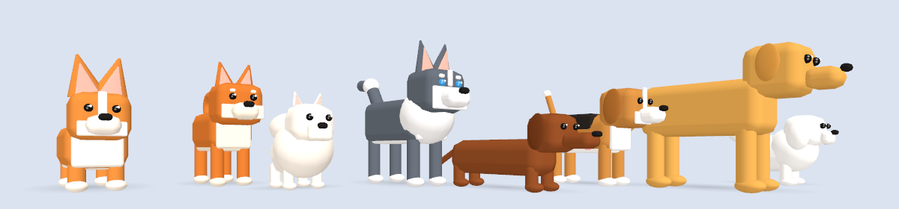

# 모니터 클리너 (맥)

화면 위를 돌아다니다가 가끔 모니터 유리에 얼굴을 붙이고 핥는 로우폴리 강아지.
핥은 자리엔 침이 남고, 마우스로 문지르면 닦인다. 강아지를 누르면 좋아함.



- 메뉴 막대 🐶 에서 견종(웰시코기·시바견·포메라니안·허스키·닥스훈트·비글·골든 리트리버·말티즈), 한 마리 더, 지금 핥아, 침 다 닦기, 소리.
- 모니터가 여러 개면 "한 마리 더"를 누를 때 마우스가 있는 화면에 나온다.
- 강아지 위가 아니면 클릭은 아래 창으로 그냥 통과한다.

## 설치

[Releases](https://github.com/41ways/monitor-cleaner-mac/releases)에서 zip 받아 풀고 응용 프로그램 폴더로.
서명 안 된 앱이라 처음엔 우클릭 → 열기. macOS 14 이상.

## 받아 온 모델

통짜 모델(뼈대 없음)을 `models/split.py` 가 삼각형 위치로 몸통·머리·다리 넷·꼬리로 잘라 `Resources/<이름>.json` 으로 만든다.
앱은 그 조각을 관절처럼 돌려서 걷고, 일어서고, 핥는다.

- "Corgi" — madtrollstudio, [Poly Pizza](https://poly.pizza/m/2neHxHTY3t), CC BY

## 빌드

Xcode 없이 명령행 도구만 있으면 된다.

```
./build.sh
```

`MonitorCleaner --shot out.png lineup|walk|lick [견종]` 으로 화면 없이 장면을 그려 볼 수 있다.
